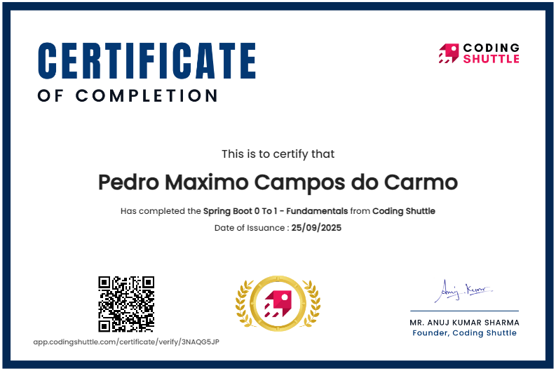

# Learning Spring Boot - Coding Shuttle

Este repositório reúne projetos do curso que ensina os fundamentos de Spring Boot: dos conceitos de Spring e Spring Boot, passando por Web MVC e persistência com JPA/Hibernate, até práticas de produção, testes, Spring Security e visão geral de deploy com CI/CD.

## Ferramentas e Tecnologias Utilizadas

### Fundações

- **Java 21** - Versão LTS mais recente
- **Maven** - Gerenciamento de dependências e build (wrapper `mvnw`/`mvnw.cmd`)
- **Spring Boot 3.5.5** - Framework principal com autoconfiguração e starters

### Desenvolvimento Web

- **Spring Web / Spring MVC** - Controllers REST e APIs
- **OpenAPI/Swagger 2.8.12** - Documentação interativa de APIs
- **Bean Validation (Jakarta Validation)** - Validação de dados
- **ModelMapper 3.2.4** - Mapeamento entre DTOs e entidades

### Persistência e Banco de Dados

- **Spring Data JPA** - Abstração para acesso a dados
- **Hibernate** - ORM principal
- **Hibernate Envers** - Auditoria automática de entidades
- **PostgreSQL** - Banco de dados principal
- **H2** - Banco de dados em memória para testes
- **Flyway** - Versionamento e migração de banco de dados

### Segurança

- **Spring Security** - Framework de segurança
- **JWT (JSON Web Tokens)** - Autenticação stateless
- **OAuth2** - Integração com provedores externos (Google)
- **BCrypt** - Hash de senhas

### Observabilidade e Monitoramento

- **Spring Boot Actuator** - Métricas e health checks
- **Logback** - Sistema de logs estruturado com rotação
- **Micrometer** - Métricas de aplicação
- **JaCoCo** - Cobertura de código

### Testes

- **JUnit 5** - Framework de testes unitários
- **Mockito** - Mocking para testes
- **AssertJ** - Assertions fluentes
- **TestContainers** - Testes de integração com containers Docker
- **Spring Boot Test** - Testes de integração Spring
- **WebTestClient** - Testes de APIs REST

### Cloud e DevOps

- **Docker** - Containerização
- **AWS Elastic Beanstalk** - Deploy e orquestração
- **AWS RDS** - Banco de dados gerenciado
- **AWS CodePipeline** - CI/CD automatizado
- **AWS CloudWatch** - Monitoramento e logs
- **AWS Auto Scaling** - Escalabilidade automática
- **Application Load Balancer** - Distribuição de carga

### Ferramentas de Desenvolvimento

- **Lombok 1.18.32** - Redução de boilerplate
- **Spring DevTools** - Hot reload durante desenvolvimento
- **Maven Compiler Plugin** - Compilação com annotation processing

## Estrutura

- **week1/**: introdução ao Spring e Spring Boot
- **springwebtutorial/**: construção de APIs REST com Spring Web
- **week3/Jpa-Tutorial/**: fundamentos de JPA/Hibernate (entidades, relacionamentos, repositórios)
- **week3-homework/Homework/**: exercícios aplicados de JPA
- **Review-Hibernate-and-JPA/**: revisão de conceitos JPA/Hibernate
- **prod-ready-features/**: recursos completos para produção incluindo:
  - Observabilidade com Spring Boot Actuator
  - Spring Profiles (dev, prod) para diferentes ambientes
  - Segurança avançada com Spring Security e JWT
  - OAuth2 com Google
  - Logging estruturado com Logback
  - Testes com TestContainers
  - Cobertura de código com JaCoCo
  - Documentação automática com OpenAPI/Swagger
  - Integração com PostgreSQL
  - Hibernate Envers para auditoria
- **prod-ready-features-2/**: implementação de conceitos avançados do Spring Security e aprendizado de testes

## Tópicos do curso

- Conceitos de Spring e inversão de controle (IoC), injeção de dependência (DI)
- Spring Boot: autoconfiguração, starters, perfis, configuração externa
- Spring Web: controllers, DTOs, validação, tratamento de erros
- Persistência: JPA/Hibernate, mapeamentos, repositórios, consultas
- Boas práticas de produção: logs, Actuator, métricas, documentação (OpenAPI)
- Spring Security avançado: JWT, OAuth2, filtros customizados, autorização baseada em roles
- Testes: JUnit 5, Mockito, AssertJ, TestContainers, testes de integração e unitários
- Deploy e CI/CD (visão geral): empacotamento, imagens, pipelines

**Áreas de expansão possíveis: Estarao neste repositorio**

- Implementação de Event-Driven Architecture
- Integração com Apache Kafka
- Caching distribuído com Redis
- GraphQL APIs
- Kubernetes deployment
- Service Mesh com Istio

## Projeto proposto por este curso

Como parte da prática sugerida neste curso, o projeto final consiste em implementar um clone do back-end da Uber utilizando Java com Spring Boot.

Minha implementação completa está disponível neste repositório: [spring-uber-backend](https://github.com/pedromaximocampos/spring-uber-backend)

## Certificado do Curso

Você poderá visualizar o certificado diretamente neste repositório e por meio deste [link](https://app.codingshuttle.com/certificate/verify/3NAQG5JP) público fornecido pela plataforma do curso.

---
